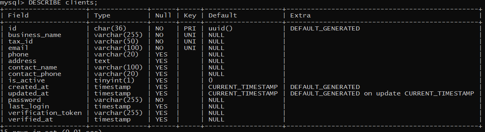

# Devlog

## [INVOICES Module] 2026-03-31

### CRUD completo para invoices

- Archivos en `src/handlers/invoiceHandlers/`:
  - `postInvoice.js` → creación de invoice en draft con primer item
  - `getInvoices.js` → `getAllInvoices`, `getInvoiceById`, `getInvoicesByQuery`
  - `updateInvoice.js` → `updateInvoice` (batch upsert + delete on quantity 0)

- Helpers en `src/utils/queryBuilder.js`:
  - `invoiceByQueryBuilder` → construcción dinámica de WHERE clause con rangos y filtros exactos

### Endpoints implementados

| Método | Endpoint | Descripción |
|--------|----------|-------------|
| POST | `/invoices` | Crear invoice en draft con primer item |
| GET | `/invoices/all` | Listar todos los invoices |
| GET | `/invoices/search?client_id=&status=&total_min=&total_max=&issue_date_from=&issue_date_to=` | Búsqueda con filtros exactos y rangos |
| GET | `/invoices/:id` | Obtener invoice por ID con sus items |
| PATCH | `/invoices/:id` | Batch update: insert/update items (quantity > 0), delete items (quantity = 0) |

### Filtros soportados en search

**Exactos:** `client_id`, `status`, `payment_terms`, `invoice_number`

**Rangos numéricos:** `total_min`, `total_max`

**Rangos de fechas:** `issue_date_from`, `issue_date_to`, `due_date_from`, `due_date_to`, `paid_at_from`, `paid_at_to`

### Manejo de errores
- `400 INVALID_ID_FORMAT` → UUID inválido
- `400 MISSING_SEARCH_PARAMETERS` → búsqueda sin filtros
- `400 INVALID_STATUS` → status no permitido
- `400 INVALID_PAYMENT_TERMS` → payment_terms no permitido
- `404 INVOICE_NOT_FOUND` → invoice no existe

### Notas
- Carrito = invoice en estado `draft`
- Un cliente puede tener un solo `draft` a la vez
- Cantidad 0 en update → elimina el item del carrito
- Búsqueda con rangos usa `BETWEEN` (si vienen ambos límites) o `>=` / `<=` (si viene solo uno)

### Próximos pasos (transacciones)
- [ ] `POST /invoices/:id/confirm` → reservar stock, generar número/fechas
- [ ] `POST /invoices/:id/deliver` → descontar stock real
- [ ] `POST /invoices/:id/paid` → marcar como pagado
- [ ] `POST /invoices/:id/cancel` → liberar stock reservado

## [INVOICES Post] 2026-03-27

### RUTA Post para invoices

- Archivos: `src/handlers/invoiceHandlers/postInvoice`
  - Necesitamos el id del cliente y el id del producto para crear las primeras relacionales
  - Cliente>Invoice (one-to-many) y crear la primera entrada de la tabla relacional Invoice>Products (invoice_items)

### Planificación para rutas de modicicación de invoices

- [PATCH] /:id          → Modificar el invoice existente: Quitar/agregar/modificar items. 
- [POST]  /:id/confirm  → Confirmar el invoice. Crear invoice_id, due_date, agregar reserved_stock a cada producto involucrado.
- [DELETE]  /:id        → Cuando pasa de draft a cancelled, al no haber ningún cambio en DDBB simplemente se borra.
- [POST]  /:id/deliver  → Cuando es retirado de depósito. Descontar stock real de cada producto, cambiar estado del invoice.
- [POST]  /:id/cancel   → Después de confirmado, al cancelar hay que descontar el reserved_stock de los productos y archivar.
- [PATCH] /:id/toggle-invoice → SOFT Delete

## [PRODUCTS CRUD] 2026-03-25

### CRUD completo para products

- Archivos: `src/handlers/productHandlers`
  - `postProduct.js` → creación de productos
  - `getProducts.js` → `getAllProducts`, `getProductById`, `getProductsByQuery`
  - `updateProduct.js` → `updateProduct`, `toggleProduct`

- Archivo: `src/utils/queryBuilder.js`
  - `productQueryBuilder` → arma columnas y valores para POST
  - `searchProductByQuery` → arma conditions y values para búsqueda dinámica
  - `updateProductQuery` → arma conditions y values para actualizaciones

- Endpoints:
  - `POST /products`
  - `GET /products/all`
  - `GET /products/search?sku=&name=&category=&is_active=`
  - `GET /products/:id`
  - `PATCH /products/:id`
  - `PATCH /products/:id/toggle-active`

- Campos permitidos:
  - Creación: `sku`, `name`, `description`, `category`, `unit_price`, `stock`, `reserved_stock`, `is_active`
  - Actualización: `name`, `description`, `unit_price`, `stock`, `reserved_stock`
  - Búsqueda: `sku` (exacta), `name` (parcial), `category` (parcial), `is_active` (exacta)

- Manejo de errores:
  - `400 MISSING_KEY_INFORMATION` → faltan datos obligatorios
  - `400 INVALID_ID_FORMAT` → UUID inválido
  - `400 MISSING_SEARCHING_PARAMETERS` → búsqueda sin filtros
  - `404 PRODUCT_NOT_FOUND` → producto no existe
  - `409` → sku duplicado

### Notas
- `sku` es único en la tabla
- Soft delete mediante `is_active`
- Todas las queries usan placeholders (SQL injection safe)
- Búsqueda con `LIKE` para `name` y `category`

## [TOGGLE Client] 2026-03-24

### Activar/desactivar cliente en DB

- Archivo: `src/handlers/clientHandlers/updateClients.js`
- Endpoint: `PATCH /clients/:id/toggle-active`
- Soft delete / reactivación de clientes
- Motivo: borrar físicamente eliminaría facturas, pagos e historial asociado
- Implementación: `UPDATE clients SET is_active = NOT is_active WHERE id = ?`
- Retorna mensaje de éxito

## [UPDATE Client] 2026-03-24

### Ruta para actualizar datos del cliente

- Archivo: `src/handlers/clientHandlers/updateClients.js`
- Endpoints:
  - [PATCH] /:id
  - [PATCH] /:id/change-password
- Para actualizar datos generales del cliente tenemos una lista de "fields autorizados".
- Checkeamos que esté intentando de cambiar algo autorizado y lo sumamos al query
- En caso de ser la contraseña, tenemos una ruta específica para eso:
  - Validamos el formato de la nueva contraseña
  - Comparamos con la anterior para evitar reemplazar con lo mismo
  - Verificamos que la contraseña anterior sea correcta
  - Hasheamos la contraseña nueva (bcrypt.hash)
  - Enviamos el UPDATE SET para actualizar

## [VERIFY Client] 2026-03-24

### Ruta para dar de alta cliente usando token de seguridad

- Archivo: `src/handlers/clientHandlers/verifyClient.js`
- Endpoint: `GET /clients/verify/:verification_token`
  - Validación de formato del token (hexadecimal de 64 caracteres)
  - Búsqueda por token y actualización en una sola query usando `affectedRows`
  - Actualizaciones:
    - `verification_token = NULL`
    - `verified_at = NOW()`
    - `is_active = true`

[Manejo de errores]
- `400 INVALID_TOKEN_FORMAT` → token no cumple el formato esperado
- `400 INVALID_OR_ALREADY_VERIFIED` → token no existe o cuenta ya activada

[Optimización]
- Uso de `affectedRows` para evitar un `SELECT` previo

### Búsqueda de clientes por query actualizado

- Podemos buscar por varios query a la vez
- Implementé una forma más dinámica para concatenar clausulas WHERE y sus valores

## [POST Client] 2026-03-23

### Ruta para creación de clientes agregada

- Archivo: `src/handlers/clientHandlers/postClient.js`
- Terminé el endpoint para creación de `clientes`:
  - Verificamos que nos llegó la información obligatoria (name, password, email...)
  - Validamos formato de email y contraseña recibidos (RegExp)
  - Hasheamos la contraseña antes de seguir con el proceso
  - Preparamos un query dependiendo la información que nos llegó por body
  - Insertamos el nuevo registro, traemos el nuevo registro de DDBB sacandole contraseña y token de verificación
  - Devolvemos el nuevo registro.

### Servicio de validaciones creado

- Archivo: `src/services/validations.js`
- Contiene funciones reutilizables para validar:
  - UUID
  - Email
  - Password
- Separación de responsabilidades: los handlers manejan la lógica de request/response, las validaciones se extraen a servicios para mantener el código limpio y testeable.

### Siguientes metas (orden de ejecución)
1. [ ] PATCH `/clients/verify` → verificar token y actualizar is_active: true
2. [ ] GET `/clients` → Traer todos los registros de clientes
3. [ ] GET `/clients/:id` → Traer clientes usando ID o 
4. [ ] POST `/clients/login` → Comparar contraseña, actualizar last_login, devolver datos del cliente y a futuro manejar JWT.

## [Clients Module] 2026-03-23

### Cambios en la base de datos
- Saqué la tabla `users`, creé `clients` en su lugar pensando en:
  - Simular un negocio real de mayoreo
  - Agregar verificación por correo electrónico
  - Darle a futuro un dashboard para revisar sus facturas y preferencias, o incluso pagar desde la app.

- Borré todas las tablas y arranqué de cero. Decisión consciente para evitar deuda técnica temprana y construir con una arquitectura más planeada.
- Estoy priorizando un enfoque más profesional/real de la app: voy a ir creando un CRUD a la vez, integrando las tablas de a poco, y chequeando que todo avance de manera armoniosa.

### Siguientes metas (orden de ejecución)
1. [ ] POST `/clients/register` → bcrypt + token de verificación
2. [ ] GET `/clients/verify` → activar cuenta
3. [ ] POST `/clients/login` → autenticación
4. [ ] GET `/clients` (con filtros y paginación)
5. [ ] PATCH `/clients/:id`
6. [ ] Modelo de `products`

### Notas
- Usando queries puras de MySQL, sin ORM.
- Una vez termine CLIENTS por completo (edge cases, errores, regexp) avanzo a la siguiente tabla.
- Todo el código se va a ir subiendo por partes, con commits claros y documentación paralela.

*Tabla `clients` - estructura actual (2026-03-23)*